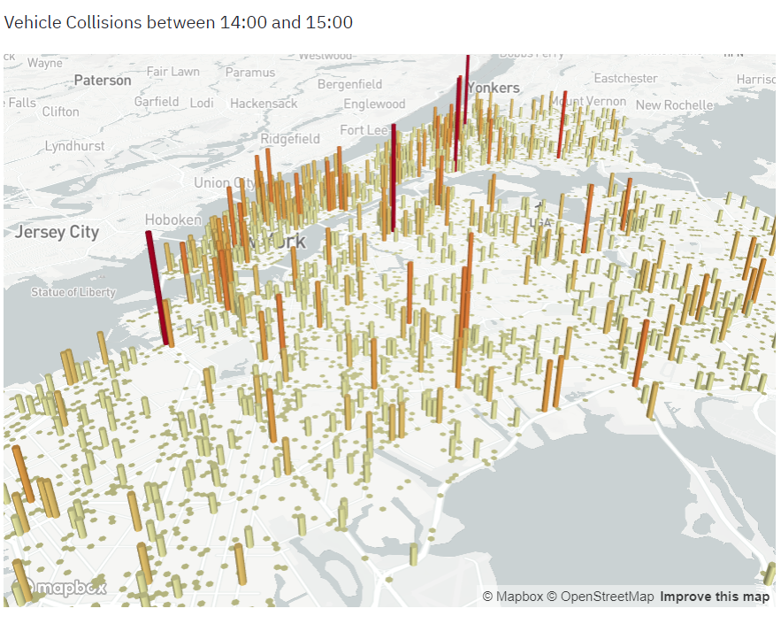

## Build-a-Data-Science-Web-App-with-Streamlit-and-Python


## เกี่ยวกับ
แอปพลิเคชั่นนี้เป็นแดชบอร์ดที่สามารถเเสดงการวิเคราะห์เกี่ยวกับชนของยานยนต์ใน NYC

---
##### Guided Projects Courses from Coursera
##### สามารถเข้าไปเรียนได้ที่นี่ [Coursera](https://www.coursera.org/projects/data-science-streamlit-python)


## ความต้องการของระบบในการทำโปรเจค
ในการทำโปรเจคจาก coursera จะมีระบบที่เตรียมเครื่องมือต่างๆสำหรับการทำโปรเจคไว้เรียบร้อยเเล้ว เเละสามารถรันโค้ดเเละเห้นผลลัพธ์ได้ในเครื่องนั้นเลย (ระบบที่เค้าเตรียมไว้ให้น่าจะเป้นระบบ Linux ดูเพิ่มเติม[ที่นี่](https://rhyme.com/)) เเต่ตัวผมอยากนำโค้ดมาศึกษาเเละรองรันในระบบ Windows 

มีดังนี้ (บางตัวผมเคยติดตั้งไว้เเล้ว):
* Python (ขณะที่ทำใช้เวอร์ชัน 3.6) 
* Dataset ที่ใช้ในการทำโปรเจคนี้ เนื่องจากมีขนาดใหญ่เกินไป สามารถโหลดได้[ที่นี่](https://drive.google.com/drive/folders/1RF_t2dK4nSKE0y6_lSqnEG4vdRExUkU7?usp=sharing)
* numpy==1.16.4
* pandas==0.24.2
* pydeck==0.3.0
* streamlit==0.57.3 --> สามารถติดตั้งได้ที่นี่ [คลิก](https://docs.streamlit.io/en/latest/troubleshooting/clean-install.html)
* plotly==4.0.0 --> สามารถติดตั้งได้ที่นี่ [คลิก](https://pypi.org/project/plotly-express/)


## วัตถุประสงค์
1. สร้างเว็บแอปพลิเคชันแบบโต้ตอบด้วย [Streamlit](https://www.streamlit.io/) และ Python
2. ใช้ [Pandas](https://pandas.pydata.org/) เพื่อการจัดการข้อมูลในกระบวนการทำงานด้านวิทยาศาสตร์ข้อมูล


## วิธีรันโค้ด
วิธีผม ผมจะรันผ่าน Anaconda Prompt ที่ผมได้สร้าง Environments เอาไว้ ดูวิธีทำ[ที่นี่](https://docs.anaconda.com/anaconda/navigator/getting-started/#managing-environments)
จากนั้นเมื่อเข้าหน้า Anaconda Prompt โดยเป็น path ที่ไฟล์ของเราอยู่ 
ให้ใช้คำสั่ง 

```py 
streamlit run app.py
```

This site is published at [Click](https://aattawut.github.io/Build-a-Data-Science-Web-App-with-Streamlit-and-Python/)
